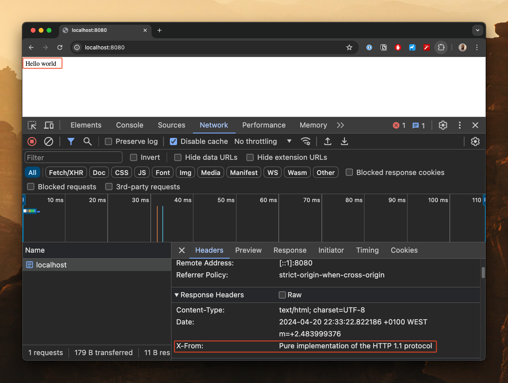

# http-go (early development)

Implementation of the Hypertext Transfer Protocol (HTTP 1.1) from scratch for learning purposes.

At the moment this project is not fully compliant with HTTP 1.1 specification, and perhaps it won't ever be given that my goal is to increase my understanding of how such a protocol is implemented and not necessarily create an alternative to net/http from the Go standard library. For such a thing I recommend [fasthttp](https://github.com/valyala/fasthttp).     

## How it works

This implementation works very similarly to HTTP implemented in Go's standard library, a server struct and a router is
enough to write an HTTP server as observed below:

```go
package main

import (
	"log"
	"os"

	"github.com/flowck/http-go"
)

func main() {
	router := http_go.NewServerDefaultRouter()

	router.GET("/", func(r *http_go.Request, w *http_go.Response) error {
		w.Headers.Set("X-From", "Pure implementation of the HTTP 1.1 protocol")
		w.Headers.Set("Content-Type", "text/html; charset=UTF-8")
		return w.Write([]byte("Hello world"))
	})

	s := http_go.Server{
		Addr:   ":8080",
		Router: router,
	}

	if err := s.ListenAndServe(); err != nil {
		log.Println(err)
		os.Exit(1)
	}
}
```



## Goals

I think that by properly supporting the two methods below the remaining HTTP methods should be trivial to implement.

- GET method
- POST method

## References

- https://http.dev/
- https://www.rfc-editor.org/rfc/rfc9110.html
